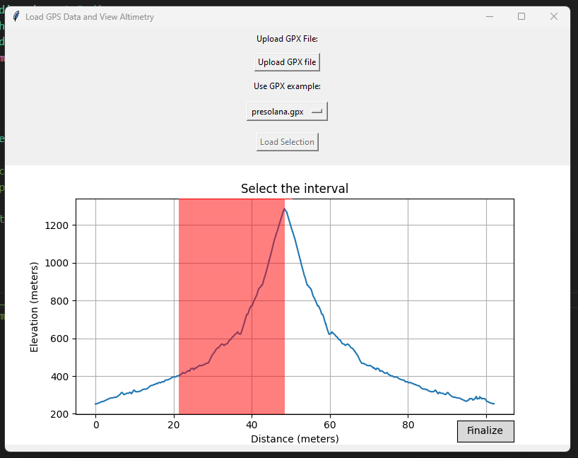
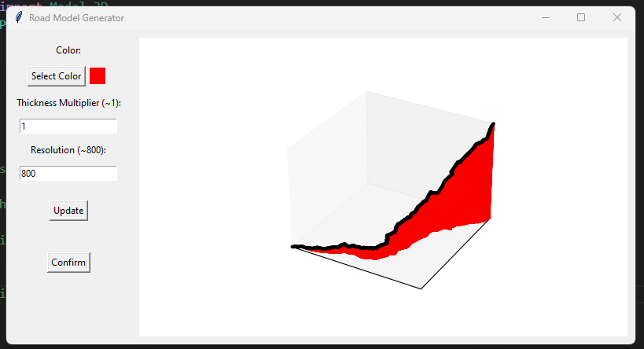
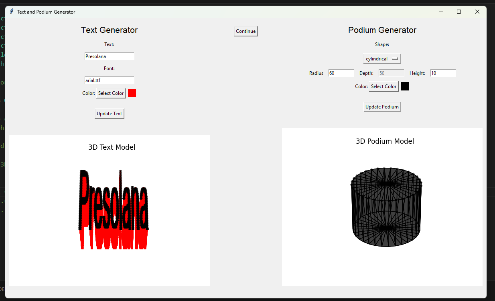

# GpsToStl
GpsToStl is a Python script designed to convert GPS data files in GPX format into 3D models in STL format. This tool provides a streamlined solution for transforming GPS tracks into visually appealing 3D representations, facilitating data analysis and visualization tasks. These 3D models can be further utilized for various applications, including 3D printing.

# GUI
After launching the main program, four screens appear in succession:

This screen allows you to load the GPX track and select the section to represent (still has some bugs if the road overlaps).

By choosing parameters like color, model thickness, and road resolution, a 3D model of the climb is created.

This screen lets you create the text to place on the podium and design the podium itself, defining their specific features.

Here, all the elements are combined to generate the final model.

# Main.py
Main.py is the primary program that invokes all the necessary functions.

# Example
The Example folder contains several GPS tracks that can be used as samples.

# Main Function
The Main Function folder includes the core functionalities:

    - GPS_function: Contains functions for managing GPS tracks and allows for the selection of segments based on elevation data.
    - STL_function: Contains useful functions for creating STL models (credit: stl_tools).

    - UphillSTL: Contains the class for converting the selected portion of the GPS track into a 3D model.
    - Text3D: Contains the class for creating 3D text.
    - Podium: Contains the class for the podium.

# Old Version
The Old Version folder collects previous attempts to create the model. Currently, the program is not very fast; however, if the method proposed in method_spline_point.py can be successfully implemented, it should run significantly faster. The challenge here is that I have managed to generate all the desired points but have not yet succeeded in creating the STL model.