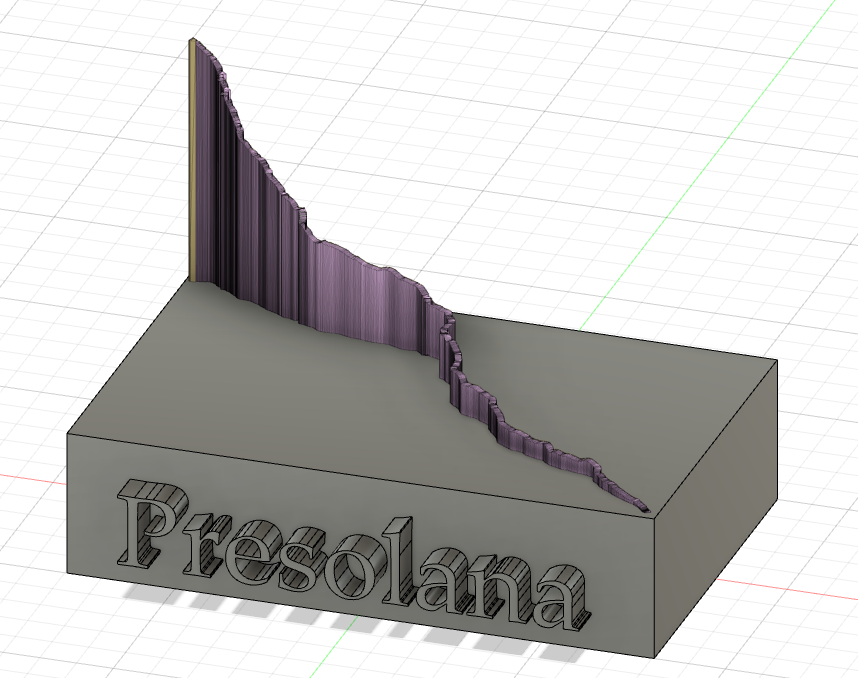

# GpsToStl
GpsToStl is a Python script designed to transform GPS data files in GPX format into 3D models in STL format. It offers a streamlined solution for converting GPS tracks into visually appealing 3D representations, facilitating data analysis and visualization tasks. These 3D models can be further utilized for various applications, including 3D printing.

# Split_gps_file
split_gps_file is a versatile tool that enables users to manipulate GPS traces with ease. From modifying GPS data to extracting specific segments based on user-defined criteria, split_gps_file enhances flexibility in handling GPS data files.

# Examples: Stelvio, Presolana, and Gavia
Stelvio, Presolana, and Gavia serve as exemplary applications of GpsToStl and split_gps_file. These examples showcase how these tools can be effectively utilized to process GPS data and create accurate 3D models from GPS tracks. The resulting 3D models can be further refined and printed using 3D printers, opening up a myriad of possibilities for visualization and physical prototyping.

Here's an example of what can be easily done using 3D modeling software (like Fusion 360). You can combine the STL output with a base, as shown in the following image:

This demonstrates how the generated STL file from the GPS data can be integrated into a 3D model for further visualization and analysis.
